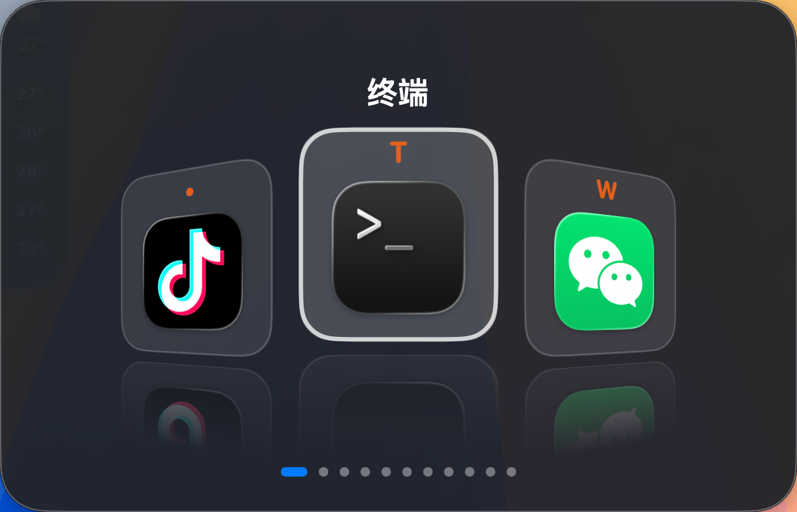

# eSwitch

macOS 环形应用切换器，玻璃拟态面板，一键呼出快速切换应用。

按住热键呼出切换器，每按一次切换到下一个应用，松开即打开/激活选中应用 —— 无需移动鼠标




---

## ✨ 特性

- **环形应用切换器** —— 中心卡片正对放大，两侧卡片绕 Y 轴透视倾斜、下沉，带地面倒影，配合弹簧动画顺滑轮播
- **玻璃拟态面板** —— 圆角深色玻璃背景 + 半透明描边 + 系统贴合阴影，顶部显示当前应用名，底部进度指示点
- **访达（Finder）支持** —— 可正常激活系统进程
- **自定义快捷键** —— 所有热键均可录制（默认 `⌘ esc`）
- **GPU 优化** —— 移除高消耗阴影/模糊/多层渐变，持续与峰值占用低，切换动画依旧流畅

---

## 📖 使用说明

### 基础操作

| 操作 | 按键（默认） | 说明 |
| --- | --- | --- |
| 呼出切换器 / 切换到下一个 | `⌘` + `esc` | 按住 `⌘` 呼出；继续按 `esc` 逐个切到下一个应用 |
| 反向切换 | `⇧` + `⌘` + `esc` | 切到上一个应用 |
| 确认选择 | 松开 `⌘` | 松开修饰键即激活当前高亮的应用 |
| 取消 | `esc`（单独） | 关闭面板，不激活任何应用 |

> 按住 `⌘` 期间，每按一次 `esc` 就会前进一个应用；松开 `⌘` 立即切换到当前高亮应用。

### 自定义快捷键

1. 点击菜单栏托盘图标 → **设置...**
2. 「呼出/切换」对应前进键，「反向切换」对应后退键
3. 点击右侧按钮后按下新的组合键（需包含 ⌘/⌥/⌃/⇧ 之一），按 `Esc` 取消录制
4. 设置实时生效，重启保留

### 其他设置

- **开机自启动**
- **面板屏幕**：主屏幕 / 跟随光标所在屏

---

## 🔧 环境要求

- macOS 12.0 及以上（激活走系统 `open -a`，任意版本可用）
- 需授予**辅助功能（Accessibility）**权限，首次启动时会弹出授权提示

---

## 🚀 安装 / 构建

### 直接运行构建产物

```bash
# 在项目根目录构建出带签名的 .app
./scripts/build.sh
open build/eSwitch.app

# 打包 DMG（不重新构建）
./scripts/package-dmg.sh

# 安装到 Applications（如需）
sudo cp -R build/eSwitch.app /Applications/
```

`scripts/build.sh` 只负责构建 + 签名 .app；DMG 由 `scripts/package-dmg.sh` 单独打包。`build.sh` 会自动优先使用钥匙串中的 `Apple Development` 证书签名；没有对应证书时请改用你自己的身份或 ad-hoc 签名。DMG 优先用 `create-dmg`（带图标布局），未安装时回退 `hdiutil`。

### 手动构建

```bash
swift build -c release
```

### 权限设置

若未弹出授权提示或误拒：

1. 打开 **系统设置 → 隐私与安全性 → 辅助功能**
2. 找到 `eSwitch` 并打开开关
3. 重启 eSwitch（托盘中点击 **退出** 后再打开）

---

## ❓ 常见问题

**切换器呼不出来？**

- 确认已授予辅助功能权限
- 托盘图标处点击「辅助功能权限」可查看状态并跳转系统设置

**跨桌面激活无效？**

- 激活遵循系统 Dock 点击语义（`open -a`）：目标应用窗口在其他桌面时，是否切到该桌面由「系统设置 → 桌面与程序坞 → 调度中心」的「切换到某个应用程序时，转到该应用已打开窗口的 Space」决定（默认开）；若手动点 Dock 图标表现同样如此，属系统层面行为，而非 eSwitch 问题

**换电脑/重装系统后设置丢了？**

- 快捷键等设置保存在本机 `UserDefaults`，不会跟随应用迁移；重新录制即可

